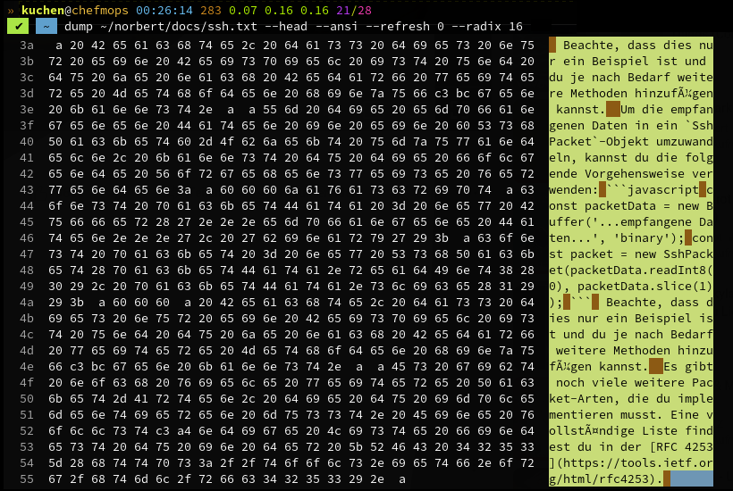

# The **`dump`** utility
**TODO**

## Example Screenshot
This is just a **first preview** screenshot.

Many feature will come directly when I've got the time..
My [**Norbert**](https://github.com/kekse1/norbert/) project is more important atm.

# Copyright and License
The Copyright is [(c) Sebastian Kucharczyk](./COPYRIGHT.txt),
and it's licensed under the [MIT](./LICENSE.txt) (also known as 'X' or 'X11' license).

