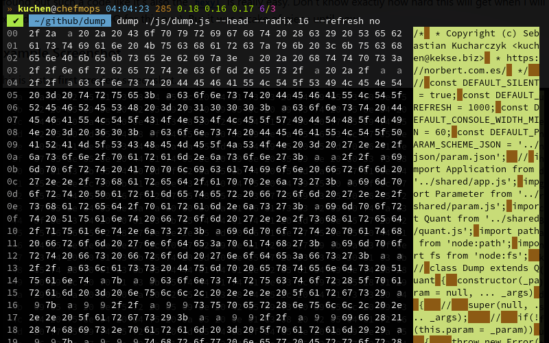

# The **`dump`** utility
My own **Radix viewer/editor**.

## Index
* [Introduction](#introduction)
	* [First words](#first-words)
	* [Example Screenshot](#example-screenshot)
* [Download](#download)
	* [Structure](#structure)
	* [Infra-Structure](#infra-structure)
* [References](#references)
* [Copyright and License](#copyright-and-license)

## Introduction
It became necessary since I wanted to inspect the changing data of my [Norbert](https://github.com/kekse1/norbert/).

### First words
It's more than a **Hex viewer**.. it's rather a **Radix viewer**; which will become a **Radix Editor** in some
time. I'm working on it just a little bit right now, since it's not the most important project for my purposes.
But it became necessary, so I invented it.

> [!TIP]
> JFYI: **Radix** is my word for a numeric **base**. The **decimal** system with base **10**,
> **hexadecimal** with **16**, or **binary** with **2**.
> So this project aim's to let you see input/file data in a specificly converted view.

I found out such a code like it's also the [**`hexyl`**](https://github.com/sharkdp/hexyl/) is really easy. Don't
know exactly how hard this will get when I will extend it (got a big TODO for this one). But it was a cake of piece
until now.

### Example Screenshot
This is just a **first preview** screenshot.

## Download
You can download it by browsing the [**`./src/`**](./src/). It's a [`Node.js`](https://nodejs.org/) **sub** project.

### Structure
* [**`js/`**](./src/js/): the real runtime code; one **startup** script (for the `numb.sh`) and one with the real logic implementation;
* [**`json/`**](./src/json/): the configuration file and a scheme file for the argv parameters; also depends on more code;
* [**`sh/`**](./src/sh/): a **startup** (bash) shell script; I'm always using such scripts massively (to better prepare the environment);

I **think** in the future I'll also provide an easy setup/install script. But not for now. We'll see..

Additionally, my [configuration `.json` file](./src/json/dump.json) will have a better structure. It all was quick-and-easy setup for me,
but the more config parameters will come, the more structure they need .. and gonna have.

### Infra-Structure
Just for your info:

> [!IMPORTANT]
> This project relies on my own JavaScript infrastructure.

So you can only see the code of this **sub** project. It doesn't really run stand-alone.

If you'd like to use it, you could bring in your own **polyfill**. If you don't want to wait until I'm going
to run my [**`init-sub-proj.sh`**](https://github.com/kekse1/scripts/?tab=readme-ov-file#init-sub-projsh).

## References
* [`hexyl`](https://github.com/sharkdp/hexyl/)

I mention it here because before this own one I was a user of this `hexyl` project. In the future, when I'm extending
this code base, I think I'm going to see this foreign project as an example for me. Like more colors for different types
of byte data, and more.

# Copyright and License
The Copyright is [(c) Sebastian Kucharczyk](./COPYRIGHT.txt),
and it's licensed under the [MIT](./LICENSE.txt) (also known as 'X' or 'X11' license).

